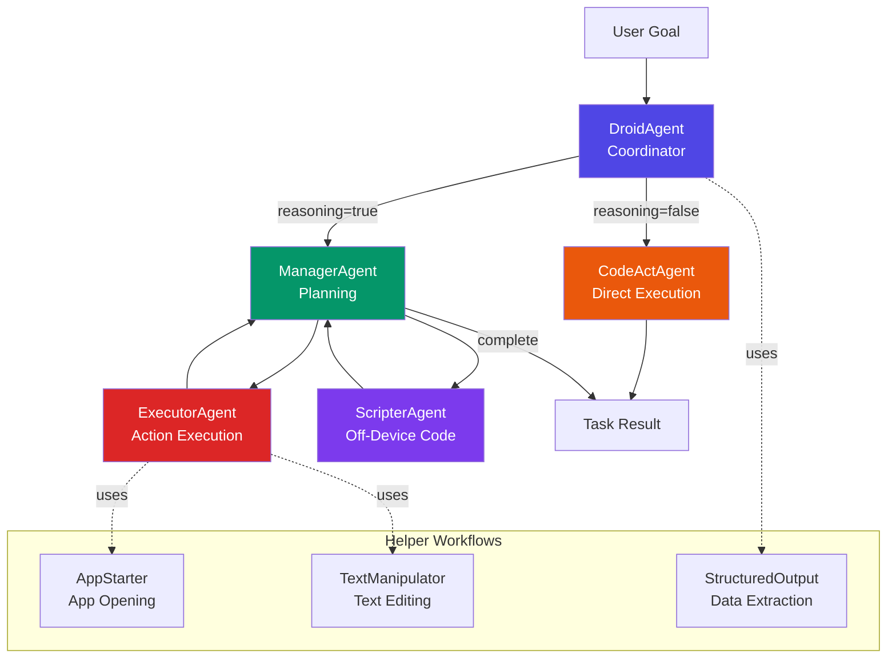
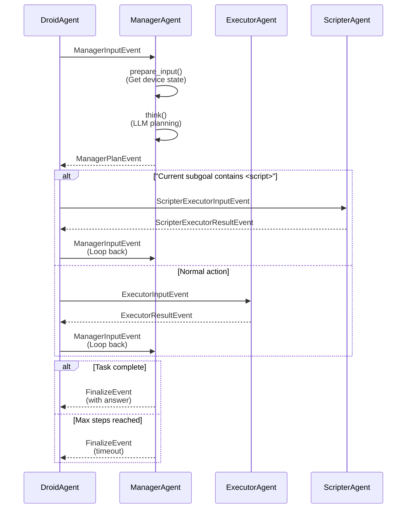
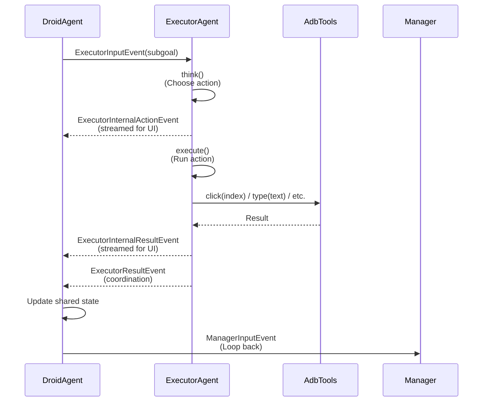
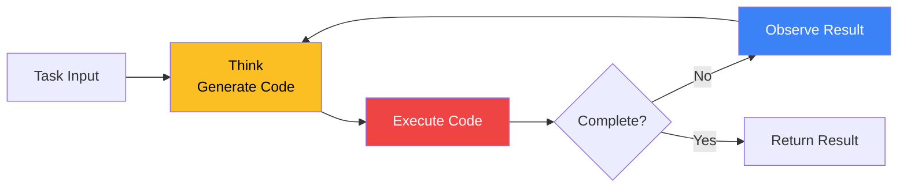
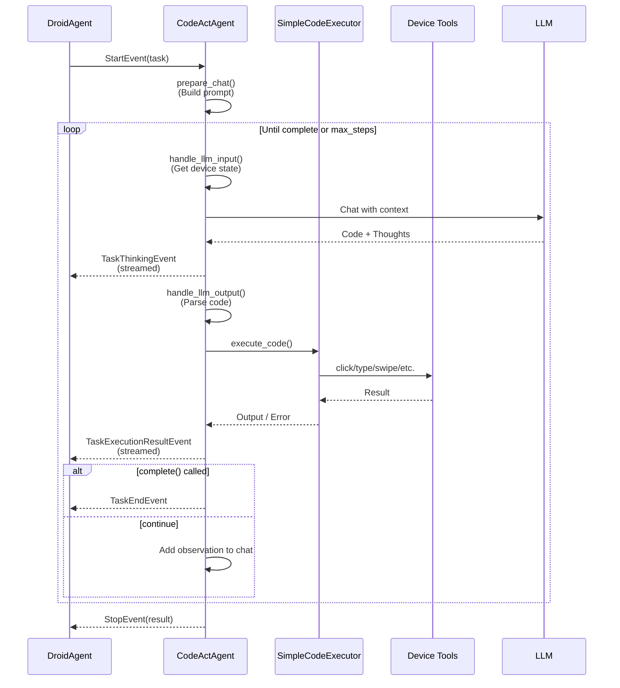
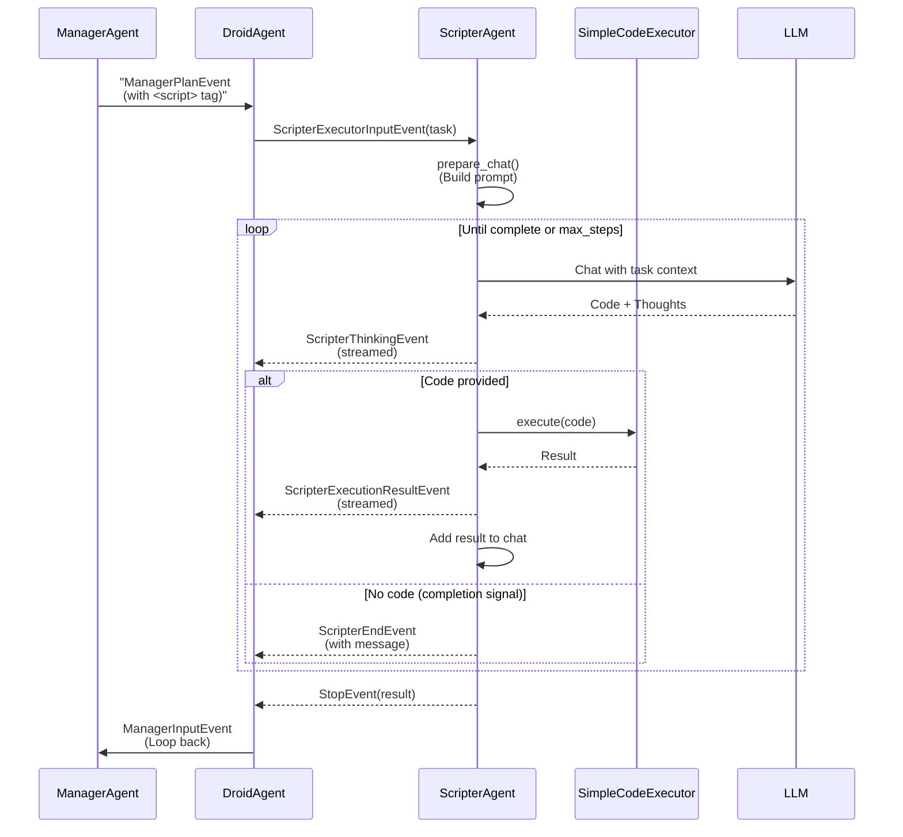
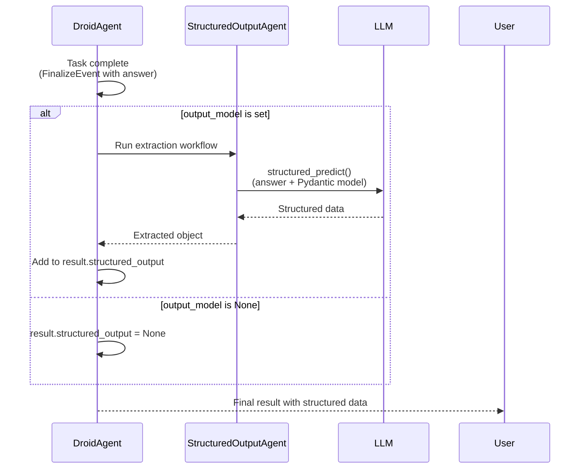

## Overview

DroidRun uses a sophisticated multi-agent architecture built on [LlamaIndex workflows](https://docs.llamaindex.ai/en/stable/module_guides/workflow/). The system employs hierarchical coordination between specialized agents, each with distinct responsibilities, to achieve complex device automation goals.



## Core Agents

### DroidAgent - Main Coordinator

**Location:** `droidrun/agent/droid/droid_agent.py`

DroidAgent is the entry point and orchestrator for all task execution. It coordinates between child agents based on the execution mode and manages the overall workflow lifecycle.

#### Initialization

```python
from droidrun import DroidAgent, AdbTools
from droidrun.config_manager.config_manager import DroidRunConfig
from llama_index.llms.openai import OpenAI

tools = AdbTools()
llm = OpenAI(model="gpt-4o")

# Option 1: Use single LLM with default configuration
agent = DroidAgent(
    goal="Find the weather forecast and create a calendar event",
    llm=llm,  # Single LLM for all agents
    tools=tools
)

# Option 2: Load configuration from YAML
config = DroidRunConfig.from_yaml("config.yaml")
agent = DroidAgent(
    goal="Find the weather forecast and create a calendar event",
    config=config,  # Full config (includes agent, device, logging, etc.)
    llm=llm,
    tools=tools
)

result = await agent.run()
```

#### Execution Modes

DroidAgent operates in two distinct modes:

**1. Direct Mode (default: reasoning=False)**
- Uses **CodeActAgent** for immediate execution
- Best for simple tasks (1-15 steps)
- Generates and executes Python code using atomic actions
- No planning overhead - fastest execution
- Set via `config.agent.reasoning = False` or leave default

```python
from droidrun import DroidAgent
from droidrun.config_manager.config_manager import DroidRunConfig

config = DroidRunConfig.from_yaml("config.yaml")
config.agent.reasoning = False  # Direct mode (default)

agent = DroidAgent(
    goal="Open Settings and take a screenshot",
    config=config,
    llm=llm,
    tools=tools
)
```

**2. Reasoning Mode (reasoning=True)**
- Uses **ManagerAgent** → **ExecutorAgent** workflow
- Best for complex, multi-step tasks requiring planning
- Manager creates strategic plans, Executor executes atomic actions
- Supports error escalation and plan adjustments
- Set via `config.agent.reasoning = True`

```python
from droidrun import DroidAgent
from droidrun.config_manager.config_manager import DroidRunConfig

config = DroidRunConfig.from_yaml("config.yaml")
config.agent.reasoning = True  # Enable reasoning mode

agent = DroidAgent(
    goal="Set up a new alarm for 7 AM with custom ringtone",
    config=config,
    llm=llm,
    tools=tools
)
```

#### Agent-Specific LLMs

You can configure different LLMs for each agent:

```python
from llama_index.llms.openai import OpenAI

llms = {
    "manager": OpenAI(model="gpt-4o"),           # Planning agent
    "executor": OpenAI(model="gpt-4o-mini"),     # Action agent
    "codeact": OpenAI(model="gpt-4o"),           # Direct execution
    "scripter": OpenAI(model="gpt-4o-mini"),     # Off-device scripts
    "text_manipulator": OpenAI(model="gpt-4o-mini"),  # Text editing
    "app_opener": OpenAI(model="gpt-4o-mini"),   # App launching
    "structured_output": OpenAI(model="gpt-4o-mini")  # Data extraction
}

agent = DroidAgent(
    goal="Complex multi-step task",
    llms=llms,  # Dict of agent-specific LLMs
    tools=tools
)
```

---

### ManagerAgent - Strategic Planner

**Location:** `droidrun/agent/manager/manager_agent.py`

The Manager is responsible for high-level planning, progress tracking, and deciding when tasks are complete. It analyzes device state, creates hierarchical plans, and routes work to the appropriate executor.

#### Responsibilities

1. **State Analysis**: Examines current UI state, action history, and progress
2. **Planning**: Creates multi-step plans with specific subgoals
3. **Progress Tracking**: Monitors completion of subgoals and adjusts plans
4. **Error Escalation**: Detects repeated failures and adjusts strategy
5. **Routing**: Decides between ExecutorAgent and ScripterAgent
6. **Completion Detection**: Determines when the goal is achieved

#### Manager Workflow



#### Planning Format

The Manager uses structured XML-like tags in its responses:

```xml
<thought>
The user wants to set an alarm. I need to:
1. Open Clock app
2. Navigate to Alarms
3. Create new alarm
4. Set time to 7 AM
5. Save alarm
</thought>

<plan>
1. [✓] Open Clock app
2. [ ] Navigate to Alarms tab
3. [ ] Tap "Add Alarm" button
4. [ ] Set time to 7:00 AM
5. [ ] Confirm and save
</plan>

<current_subgoal>
Navigate to Alarms tab by clicking the "Alarms" button
</current_subgoal>
```

For answer-type tasks:

```xml
<thought>
The user asked for the Android version. I can see it displayed on screen.
</thought>

<request_accomplished>
The Android version is 14.0
</request_accomplished>
```

#### Script Routing

When the Manager detects a task requiring off-device computation, it wraps the task in `<script>` tags:

```xml
<plan>
1. [✓] Extract contact information from screen
2. [ ] <script>Parse the contact data and format as vCard</script>
3. [ ] Save formatted vCard to file
</plan>

<current_subgoal>
<script>
Parse the following contact information and format as a vCard:
Name: John Doe
Phone: +1-555-0100
Email: john@example.com

Return the formatted vCard string.
</script>
</current_subgoal>
```

#### Error Escalation

The Manager tracks action outcomes and detects repeated failures:

```python
# In DroidAgentState
err_to_manager_thresh: int = 2  # Consecutive errors before escalation

# Error detection in DroidAgent.handle_executor_result()
if len(self.shared_state.action_outcomes) >= err_thresh:
    latest = self.shared_state.action_outcomes[-err_thresh:]
    error_count = sum(1 for o in latest if not o)
    if error_count == err_thresh:
        logger.warning(f"⚠️ Error escalation: {err_thresh} consecutive errors")
        self.shared_state.error_flag_plan = True
```

When `error_flag_plan=True`, the Manager receives error context and adjusts its strategy.

---

### ExecutorAgent - Action Specialist

**Location:** `droidrun/agent/executor/executor_agent.py`

The Executor is responsible for selecting and executing specific atomic actions to achieve the current subgoal provided by the Manager.

#### Responsibilities

1. **Action Selection**: Chooses the best atomic action for the subgoal
2. **Action Execution**: Executes device interactions (tap, type, swipe, etc.)
3. **Outcome Reporting**: Reports success/failure and provides summaries
4. **Custom Tool Support**: Can execute user-defined custom tools

#### Executor Workflow



#### Action Format

The Executor returns actions in JSON format:

```json
{
  "action": "click",
  "index": 5,
  "thought": "The 'Alarms' tab button is at index 5",
  "description": "Click the Alarms tab to navigate"
}
```

For text input:

```json
{
  "action": "type",
  "text": "john@example.com",
  "index": 3,
  "thought": "Need to input email into the focused text field",
  "description": "Type email address into the input field"
}
```

#### Custom Tool Execution

The Executor can execute custom tools defined by users:

```python
def get_password(tools, credential_id: str) -> str:
    """Retrieve password from credential manager."""
    return tools.credential_manager.get_secret(credential_id)

custom_tools = {
    "get_password": {
        "signature": "get_password(credential_id: str) -> str",
        "description": "Retrieve a password from secure storage",
        "function": get_password
    }
}

agent = DroidAgent(
    goal="Login to app with stored credentials",
    llm=llm,
    tools=tools,
    custom_tools=custom_tools  # Executor can now use get_password
)
```

Executor action:

```json
{
  "action": "get_password",
  "credential_id": "gmail_password",
  "thought": "Need to retrieve stored password for login",
  "description": "Get Gmail password from credential manager"
}
```

---

### CodeActAgent - Direct Executor

**Location:** `droidrun/agent/codeact/codeact_agent.py`

CodeActAgent implements a ReAct-style (Reasoning + Acting) cycle that generates and executes Python code to interact with the device. It's used in non-reasoning mode or when DroidAgent needs to execute code-based tasks.

#### ReAct Cycle



#### Code Generation

CodeActAgent generates Python code using available atomic actions:

```python
# Example generated code
click(tools, 5)  # Tap element at index 5
type(tools, "hello@example.com", 3)  # Type into element 3
remember("User's email is hello@example.com")  # Store in memory
complete(True, "Email entered successfully")  # Mark complete
```

#### Execution Flow



#### Safe Execution Mode

CodeActAgent supports restricted execution for security:

```yaml
# config.yaml
safe_execution:
  codeact:
    safe_execution: true
    allowed_modules:
      - re
      - json
      - datetime
    blocked_modules:
      - os
      - subprocess
      - sys
    allowed_builtins:
      - len
      - str
      - int
      - float
    blocked_builtins:
      - eval
      - exec
      - __import__
```

When enabled:
- Only allowed modules can be imported
- Blocked modules raise `ImportError`
- Only allowed builtins are available
- No file system or network access

#### Memory System

CodeActAgent maintains episodic memory across steps:

```python
# Using remember() function
remember("User prefers dark mode")
remember("Last search query: weather forecast")

# Memory is injected into subsequent prompts
# Accessible via self.tools.memory in code
```

---

### ScripterAgent - Off-Device Computation

**Location:** `droidrun/agent/scripter/scripter_agent.py`

ScripterAgent handles Python code execution for tasks that don't require device interaction - data processing, API calls, computations, etc.

#### Use Cases

- **Data Transformation**: Parse, format, or transform extracted data
- **API Calls**: Fetch information from external services
- **Calculations**: Perform mathematical or logical computations
- **File Operations**: Process files on the host machine
- **Text Processing**: Parse and manipulate text with regex, etc.

#### ScripterAgent vs CodeActAgent

| Feature | ScripterAgent | CodeActAgent |
|---------|---------------|--------------|
| **Device Access** | No | Yes |
| **Available Tools** | Python stdlib + requests | Atomic actions (click, type, etc.) |
| **Execution Context** | Host machine | Device via ADB |
| **State Persistence** | Yes (Jupyter-style) | No (fresh each call) |
| **Completion Signal** | No code in response | `complete()` function |
| **Max Steps** | Configurable (default: 10) | Agent max_steps |

#### Workflow



#### State Preservation

ScripterAgent uses `use_same_scope=True` to persist variables:

```python
# Step 1: Extract data
data = {
    "name": "John Doe",
    "email": "john@example.com"
}

# Step 2: Transform (variables persist!)
formatted = f"Name: {data['name']}\nEmail: {data['email']}"

# Step 3: Return result (no code = completion)
# Agent responds with text only, no code block
```

#### Example Usage

Manager detects need for computation:

```xml
<plan>
1. [✓] Extract contact list from screen
2. [ ] <script>Convert contact list to CSV format</script>
3. [ ] Save CSV file
</plan>

<current_subgoal>
<script>
Convert the following contact data to CSV format:
[
  {"name": "Alice", "phone": "555-0100"},
  {"name": "Bob", "phone": "555-0101"}
]

Return the CSV string with headers.
</script>
</current_subgoal>
```

ScripterAgent execution:

```python
# Step 1: Parse and convert
import json

contacts = [
  {"name": "Alice", "phone": "555-0100"},
  {"name": "Bob", "phone": "555-0101"}
]

csv_lines = ["name,phone"]
for contact in contacts:
    csv_lines.append(f"{contact['name']},{contact['phone']}")

csv_output = "\n".join(csv_lines)
print(csv_output)

# Step 2: Return result (no code, just message)
# "Here is the CSV format:
# name,phone
# Alice,555-0100
# Bob,555-0101"
```

#### Configuration

```yaml
# config.yaml
agent:
  scripter:
    enabled: true
    max_steps: 10
    execution_timeout: 30
    safe_execution: true
```

---

## Helper Workflows

### AppStarter - Intelligent App Launching

**Location:** `droidrun/agent/oneflows/app_starter_workflow.py`

AppStarter uses an LLM to match natural language app descriptions to installed package names, then launches the app.

#### How It Works

```python
# Called by ExecutorAgent when executing open_app action
async def open_app(tools: Tools, app_description: str) -> str:
    """Open app using LLM-based package matching."""
    # Get installed apps
    apps = tools.get_apps(include_system=True)

    # Create AppStarter workflow
    workflow = AppStarter(tools=tools, llm=app_opener_llm)

    # Run workflow
    result = await workflow.run(app_description=app_description)
    return result
```

#### Example

```python
# User: "Open Settings"
# AppStarter:
# 1. Gets app list: [{"label": "Settings", "package": "com.android.settings"}, ...]
# 2. Asks LLM to match "Settings" → "com.android.settings"
# 3. Calls tools.start_app("com.android.settings")
```

---

### TextManipulator - Advanced Text Editing

**Location:** `droidrun/agent/oneflows/text_manipulator.py`

TextManipulator handles complex text editing tasks that go beyond simple typing - edits, insertions, formatting, etc.

#### When It's Used

The Manager detects text manipulation mode when:
1. A text field is focused
2. The field contains existing text
3. The subgoal requires modifying (not just typing) text

#### How It Works

```python
# Called by ExecutorAgent when text manipulation is needed
def run_text_manipulation_agent(
    instruction: str,           # Overall goal
    current_subgoal: str,       # What to do with text
    current_text: str,          # Current text field content
    overall_plan: str,          # Full plan context
    historical_plan: str,       # Progress so far
    llm: LLM,
    max_retries: int = 4
) -> tuple[str, str]:
    """Generate code to manipulate text field content."""
    # Returns: (final_text, raw_code)
```

#### Constrained Execution

TextManipulator uses a highly restricted sandbox:

```python
# ONLY these are available:
# - ORIGINAL: str (current text content)
# - input_text(text: str): function (clear and type)

# NO imports, NO builtins, NO file system
```

#### Code Generation Pattern

```python
# Example generated code:
new_text = ORIGINAL.replace("old", "new")
input_text(new_text)

# Or:
lines = ORIGINAL.split("\n")
lines.append("New line")
new_text = "\n".join(lines)
input_text(new_text)
```

#### Error Correction Loop

If code fails, the error is sent back to the LLM:

```python
# Attempt 1: Code fails
try:
    exec(code, sandbox)
except Exception as e:
    # Attempt 2: Send error back
    messages.append(ChatMessage(
        role="user",
        content=f"Your code had this error:\n{traceback.format_exc()}\n\nFix it."
    ))
    # LLM generates corrected code
```

#### Example Usage

Manager detects text manipulation:

```python
# Device state shows focused text field:
# <node index="3" text="Hello Wrld" focused="true" editable="true"/>

# Manager subgoal:
# "Fix the typo in the focused text field (change 'Wrld' to 'World')"

# TextManipulator generates:
new_text = ORIGINAL.replace("Wrld", "World")
input_text(new_text)

# Result: "Hello World" typed into field
```

---

### StructuredOutputAgent - Data Extraction

**Location:** `droidrun/agent/oneflows/structured_output_agent.py`

StructuredOutputAgent extracts structured data from the final answer using LlamaIndex's `structured_predict()`.

#### Use Case

When you need to extract specific fields from the agent's answer:

```python
from pydantic import BaseModel, Field

class WeatherInfo(BaseModel):
    """Weather forecast data."""
    temperature: int = Field(description="Temperature in Fahrenheit")
    condition: str = Field(description="Weather condition (sunny, rainy, etc.)")
    location: str = Field(description="City name")

agent = DroidAgent(
    goal="Check the weather forecast",
    llm=llm,
    tools=tools,
    output_model=WeatherInfo  # Request structured output
)

result = await agent.run()
# result.structured_output = WeatherInfo(temperature=72, condition="sunny", location="San Francisco")
```

#### How It Works



#### Workflow

```python
# Inside StructuredOutputAgent
async def extract_structured_output(self, ctx: Context, ev: StartEvent) -> StopEvent:
    """Extract structured output using structured_predict()."""

    # Create prompt for extraction
    prompt = PromptTemplate(
        "Extract structured information from the following text:\n\n{text}"
    )

    # Use structured_predict to extract data
    structured_output = self.llm.structured_predict(
        self.pydantic_model,
        prompt,
        text=self.answer_text
    )

    return StopEvent(result={
        "structured_output": structured_output,
        "success": True
    })
```

#### Example

Agent answer:
```
The weather in San Francisco is currently 72°F and sunny.
```

Extracted structure:
```python
WeatherInfo(
    temperature=72,
    condition="sunny",
    location="San Francisco"
)
```

---

## Workflow Events & Coordination

DroidRun uses two types of events:

### Coordination Events

**Purpose**: Route workflow execution between agents
**Location**: `droidrun/agent/droid/events.py`
**Characteristics**:
- Minimal data (only what's needed for routing)
- NOT streamed to frontend
- Used in workflow step handlers

```python
class ManagerInputEvent(Event):
    """Trigger Manager workflow for planning"""
    pass

class ManagerPlanEvent(Event):
    """Coordination event from ManagerAgent to DroidAgent"""
    plan: str
    current_subgoal: str
    thought: str
    manager_answer: str = ""

class ExecutorInputEvent(Event):
    """Trigger Executor workflow for action execution"""
    current_subgoal: str

class ExecutorResultEvent(Event):
    """Coordination event from ExecutorAgent to DroidAgent"""
    action: Dict
    outcome: bool
    error: str
    summary: str
```

### Internal Events

**Purpose**: Stream debugging information to frontend/logs
**Location**: `droidrun/agent/manager/events.py`, `droidrun/agent/executor/events.py`
**Characteristics**:
- Rich metadata (thoughts, raw JSON, etc.)
- Streamed to frontend via `ctx.write_event_to_stream()`
- Used for debugging and UI updates

```python
class ManagerInternalPlanEvent(Event):
    """Internal Manager planning event with full state"""
    plan: str
    current_subgoal: str
    thought: str
    manager_answer: str = ""
    memory_update: str = ""  # Debugging: LLM's memory additions

class ExecutorInternalActionEvent(Event):
    """Internal Executor action selection event"""
    action_json: str
    thought: str            # Debugging: LLM's reasoning
    description: str

class ExecutorInternalResultEvent(Event):
    """Internal Executor result event"""
    action: Dict
    outcome: bool
    error: str
    summary: str
    thought: str = ""       # Debugging: LLM's thought process
    action_json: str = ""   # Debugging: Raw action JSON
```

### Event Flow Pattern

```python
# In child agent (e.g., ManagerAgent)
@step
async def think(self, ctx: Context, ev: ManagerThinkingEvent) -> ManagerInternalPlanEvent:
    # ... LLM call and planning ...

    event = ManagerInternalPlanEvent(
        plan=parsed["plan"],
        current_subgoal=parsed["current_subgoal"],
        thought=parsed["thought"],
        manager_answer=parsed["answer"],
        memory_update=memory_update  # Rich metadata
    )

    # Stream to frontend for debugging/UI
    ctx.write_event_to_stream(event)

    return event  # Propagate to finalize()

@step
async def finalize(self, ctx: Context, ev: ManagerInternalPlanEvent) -> StopEvent:
    # Return minimal data to parent workflow
    return StopEvent(result={
        "plan": ev.plan,
        "current_subgoal": ev.current_subgoal,
        "thought": ev.thought,
        "manager_answer": ev.manager_answer
        # memory_update NOT included (debugging only)
    })

# In parent (DroidAgent)
@step
async def run_manager(self, ctx: Context, ev: ManagerInputEvent) -> ManagerPlanEvent:
    # Run Manager workflow
    handler = self.manager_agent.run()

    # Stream nested events (including ManagerInternalPlanEvent)
    async for nested_ev in handler.stream_events():
        self.handle_stream_event(nested_ev, ctx)  # Forward to parent stream

    result = await handler  # Get minimal StopEvent result

    # Return coordination event (minimal data for routing)
    return ManagerPlanEvent(
        plan=result["plan"],
        current_subgoal=result["current_subgoal"],
        thought=result["thought"],
        manager_answer=result.get("manager_answer", "")
    )
```

---

## DroidAgentState - Shared Coordination State

**Location**: `droidrun/agent/droid/events.py`

`DroidAgentState` is a Pydantic model that holds coordination state shared across all agents. It's passed to child agents during initialization and updated throughout execution.

### Key Fields

```python
class DroidAgentState(BaseModel):
    # Task context
    instruction: str = ""           # Original user goal
    step_number: int = 0            # Current step counter

    # Device state
    formatted_device_state: str = ""      # Current UI hierarchy
    previous_formatted_device_state: str  # Previous UI (for comparison)
    focused_text: str = ""                # Text in focused element
    a11y_tree: List[Dict] = []            # Raw accessibility tree
    phone_state: Dict = {}                # Device metadata

    # App tracking
    current_package_name: str = ""
    current_activity_name: str = ""
    visited_packages: set = set()
    visited_activities: set = set()

    # Screen capture
    width: int = 0
    height: int = 0
    screenshot: str | bytes | None = None

    # Action history
    action_pool: List[Dict] = []          # All actions (for replay)
    action_history: List[Dict] = []       # Executed actions
    summary_history: List[str] = []       # Action summaries
    action_outcomes: List[bool] = []      # Success/failure
    error_descriptions: List[str] = []    # Error messages

    # Last action info
    last_action: Dict = {}
    last_summary: str = ""
    last_action_thought: str = ""

    # Memory
    memory: str = ""                      # Remembered information
    message_history: List[Dict] = []      # Chat history (Manager)

    # Planning state
    plan: str = ""
    current_subgoal: str = ""
    finish_thought: str = ""
    progress_status: str = ""
    manager_answer: str = ""              # For answer-type tasks

    # Error handling
    error_flag_plan: bool = False         # Error escalation flag
    err_to_manager_thresh: int = 2        # Errors before escalation

    # Script execution
    scripter_history: List[Dict] = []
    last_scripter_message: str = ""
    last_scripter_success: bool = True

    # Custom variables (user-defined)
    custom_variables: Dict = {}

    # App Cards
    app_card: str = ""                    # Current app guidance
    app_card_loading_task: asyncio.Task | None = None
```

### Usage Pattern

```python
# Initialized in DroidAgent.__init__()
self.shared_state = DroidAgentState(
    instruction=goal,
    err_to_manager_thresh=2,
    user_id=self.user_id,
    runtype=self.runtype
)

# Passed to child agents during initialization
self.manager_agent = ManagerAgent(
    llm=manager_llm,
    tools_instance=tools_instance,
    shared_state=self.shared_state,  # Same instance shared
    agent_config=self.config.agent,
    custom_tools=custom_tools
)

# Child agents read and update state
# In ManagerAgent.prepare_input():
self.shared_state.formatted_device_state = formatted_text
self.shared_state.focused_text = focused_text
self.shared_state.update_current_app(package_name, activity_name)

# In DroidAgent.handle_executor_result():
self.shared_state.action_history.append(result["action"])
self.shared_state.action_outcomes.append(result["outcome"])
self.shared_state.step_number += 1
```

### Thread Safety

`DroidAgentState` is **NOT** thread-safe. All updates happen within the async workflow context, avoiding race conditions. However, be aware:

- Each agent receives the **same instance** (not a copy)
- Updates are immediately visible to all agents
- No explicit locking is needed due to async single-threaded execution

---

## Workflow Execution Patterns

### Pattern 1: Parent-Child Workflow Nesting

DroidAgent runs child workflows and streams their events:

```python
@step
async def run_manager(self, ctx: Context, ev: ManagerInputEvent) -> ManagerPlanEvent:
    # Run child workflow
    handler = self.manager_agent.run()

    # Stream nested events to parent context
    async for nested_ev in handler.stream_events():
        self.handle_stream_event(nested_ev, ctx)

    # Wait for completion and get result
    result = await handler

    # Transform to coordination event
    return ManagerPlanEvent(
        plan=result["plan"],
        current_subgoal=result["current_subgoal"],
        # ... other fields
    )
```

### Pattern 2: Event Filtering

Parent filters which events to forward:

```python
def handle_stream_event(self, ev: Event, ctx: Context):
    # Special handling for specific events
    if isinstance(ev, EpisodicMemoryEvent):
        self.current_episodic_memory = ev.episodic_memory
        return  # Don't forward

    # Never forward StopEvent (internal to child)
    if not isinstance(ev, StopEvent):
        ctx.write_event_to_stream(ev)  # Forward to parent stream

        # Track trajectory events
        if isinstance(ev, ScreenshotEvent):
            self.trajectory.screenshots.append(ev.screenshot)
        elif isinstance(ev, MacroEvent):
            self.trajectory.macro.append(ev)
```

### Pattern 3: Workflow Step Handlers

Each step is decorated with `@step` and handles specific event types:

```python
@step
async def run_manager(
    self, ctx: Context, ev: ManagerInputEvent
) -> ManagerPlanEvent | FinalizeEvent:
    """Handles ManagerInputEvent, returns routing event."""
    # Pre-flight checks
    if self.shared_state.step_number >= self.config.agent.max_steps:
        return FinalizeEvent(success=False, reason="Max steps")

    # Execute workflow
    handler = self.manager_agent.run()
    async for nested_ev in handler.stream_events():
        self.handle_stream_event(nested_ev, ctx)
    result = await handler

    # Return routing event
    return ManagerPlanEvent(plan=result["plan"], ...)

@step
async def handle_manager_plan(
    self, ctx: Context, ev: ManagerPlanEvent
) -> ExecutorInputEvent | ScripterExecutorInputEvent | FinalizeEvent:
    """Routes based on Manager's plan."""
    # Check for completion
    if ev.manager_answer.strip():
        return FinalizeEvent(success=True, reason=ev.manager_answer)

    # Check for script tag
    if "<script>" in ev.current_subgoal:
        return ScripterExecutorInputEvent(task=extracted_task)

    # Default: route to Executor
    return ExecutorInputEvent(current_subgoal=ev.current_subgoal)
```

### Pattern 4: Error Handling and Recovery

Agents use try-except with graceful degradation:

```python
@step
async def think(self, ctx: Context, ev: ManagerThinkingEvent) -> ManagerInternalPlanEvent:
    try:
        response = await acall_with_retries(self.llm, chat_messages)
        output_planning = response.message.content
    except Exception as e:
        logger.error(f"LLM call failed: {e}")
        raise RuntimeError(f"Error calling LLM in manager: {e}") from e

    # Validate and retry if needed
    output_planning = await self._validate_and_retry_llm_call(
        ctx=ctx,
        initial_messages=messages,
        initial_response=output_planning
    )

    # Parse and return
    parsed = parse_manager_response(output_planning)
    return ManagerInternalPlanEvent(...)
```

---

## Configuration and Customization

### Agent Configuration (config.yaml)

```yaml
agent:
  max_steps: 20
  reasoning: true
  after_sleep_action: 1.0  # Seconds to wait after actions
  wait_for_stable_ui: 0.3  # Wait for UI stabilization
  prompts_dir: config/prompts

  manager:
    vision: true
    system_prompt: system.jinja2  # Located in prompts_dir/manager/

  executor:
    vision: true
    system_prompt: system.jinja2  # Located in prompts_dir/executor/

  codeact:
    vision: false
    safe_execution: true
    system_prompt: system.jinja2  # Located in prompts_dir/codeact/
    user_prompt: user.jinja2

  scripter:
    enabled: true
    max_steps: 10
    execution_timeout: 30.0
    safe_execution: true
    system_prompt_path: system.jinja2  # Located in prompts_dir/scripter/

  app_cards:
    enabled: true
    mode: local  # local, server, or composite
    app_cards_dir: config/app_cards
    server_url: null
    server_timeout: 2.0
    server_max_retries: 2
```

### Custom Prompts

Prompts are Jinja2 templates in `droidrun/config/prompts/`. You can provide custom prompts in two ways:

**1. Via prompts parameter (direct Jinja2 strings):**

```python
custom_prompts = {
    "manager_system": """You are the Manager agent for device automation.

Your goal: {{ instruction }}

Current device date: {{ device_date }}


## App-Specific Guidance
{{ app_card }}


Follow this format:
<thought>Your reasoning</thought>
<plan>
1. [✓] Completed
2. [ ] Current
3. [ ] Future
</plan>
<current_subgoal>Next action</current_subgoal>
""",
    "executor_system": "Custom executor prompt...",
}

agent = DroidAgent(
    goal="Task",
    llm=llm,
    tools=tools,
    prompts=custom_prompts
)
```

**2. Via config.yaml (file paths):**

```yaml
agent:
  prompts_dir: config/prompts
  manager:
    system_prompt: custom_manager.jinja2  # Reads from prompts_dir/manager/custom_manager.jinja2
  executor:
    system_prompt: custom_executor.jinja2
```

### Custom Variables

Pass custom variables accessible to all agents and in prompts:

```python
agent = DroidAgent(
    goal="Book a flight",
    llm=llm,
    tools=tools,
    variables={
        "departure_city": "San Francisco",
        "destination": "New York",
        "date": "2024-03-15",
        "budget": 500
    }
)

# Variables accessible in:
# - Prompts: {{ variables.departure_city }}
# - Shared state: shared_state.custom_variables
```

---

## Best Practices

### Choosing Execution Mode

**Use Direct Mode (reasoning=False) when:**
- Task is simple and atomic (1-15 steps)
- No complex navigation required
- Speed is critical
- Task doesn't require strategic planning

**Use Reasoning Mode (reasoning=True) when:**
- Task has multiple steps requiring coordination
- Need to navigate between apps or screens
- Task requires error recovery and plan adjustment
- Task involves conditional logic or decision-making

### Agent-Specific LLM Selection

**Guidelines:**
- **Manager**: Use most capable model (GPT-4o, Gemini-2.0-Flash) for planning
- **Executor**: Can use faster model (GPT-4o-mini) for action selection
- **CodeActAgent**: Use capable model for code generation
- **ScripterAgent**: Use fast model for off-device computation
- **Text Manipulator**: Fast model sufficient for text editing
- **App Opener**: Fast model sufficient for package matching

### Error Handling

**Implement retry logic in custom tools:**

```python
def my_custom_tool(tools, param: str) -> str:
    """Custom tool with retry logic."""
    max_retries = 3
    for attempt in range(max_retries):
        try:
            result = perform_operation(param)
            return result
        except Exception as e:
            if attempt == max_retries - 1:
                return f"Error: {e}"
            time.sleep(1)  # Backoff
```

**Set appropriate error escalation threshold:**

```python
# In DroidAgentState initialization
self.shared_state = DroidAgentState(
    instruction=goal,
    err_to_manager_thresh=3  # Increase for noisy environments
)
```

### Memory Management

**Use remember() strategically:**

```python
# Good: Store information that will be needed later
remember("User's email: user@example.com")
remember("Selected option: Premium plan")

# Avoid: Storing transient state
remember("Clicked button at index 5")  # Not useful later
```

**Clean memory periodically:**

```python
# Manager can clear irrelevant memory
self.shared_state.memory = ""  # Clear after major milestones
```

### Performance Optimization

**Enable vision selectively:**

```yaml
agent:
  manager:
    vision: true   # Enable for planning with visual context
  executor:
    vision: false  # Disable if UI hierarchy sufficient
  codeact:
    vision: false  # Usually not needed
```

**Tune max_steps appropriately:**

```python
from droidrun import DroidAgent
from droidrun.config_manager.config_manager import DroidRunConfig

config = DroidRunConfig()

# Simple task
config.agent.max_steps = 5
agent = DroidAgent(goal="Open Settings", config=config, llm=llm, tools=tools)

# Complex task
config.agent.max_steps = 50
agent = DroidAgent(goal="Multi-app workflow", config=config, llm=llm, tools=tools)
```

---

## Debugging and Observability

### Enable Tracing

```python
from droidrun import DroidAgent
from droidrun.config_manager.config_manager import DroidRunConfig
from droidrun.config_manager import TracingConfig

config = DroidRunConfig()
config.tracing.enabled = True

agent = DroidAgent(
    goal="Task",
    config=config,
    llm=llm,
    tools=tools
)

# Or pass tracing_config directly:
agent = DroidAgent(
    goal="Task",
    llm=llm,
    tools=tools,
    tracing_config=TracingConfig(enabled=True)
)

# Traces available at http://localhost:6006 (Arize Phoenix)
```

### Event Streaming

Monitor execution in real-time:

```python
handler = agent.run()

async for event in handler.stream_events():
    if isinstance(event, ManagerInternalPlanEvent):
        print(f"Manager Plan: {event.plan}")
    elif isinstance(event, ExecutorInternalActionEvent):
        print(f"Executor Action: {event.action_json}")
    elif isinstance(event, TaskThinkingEvent):
        print(f"CodeAct Thought: {event.thoughts}")

result = await handler
```

### Trajectory Saving

Configure via config.yaml:

```yaml
logging:
  debug: false
  save_trajectory: "action"  # "none", "step", or "action"
  rich_text: false
```

Or programmatically:

```python
from droidrun import DroidAgent
from droidrun.config_manager.config_manager import DroidRunConfig
from droidrun.config_manager import LoggingConfig

config = DroidRunConfig()
config.logging.save_trajectory = "action"
config.logging.debug = True

agent = DroidAgent(goal="Task", config=config, llm=llm, tools=tools)
```

**Trajectory Levels:**
- **none**: No trajectory saved (default)
- **step**: Save UI state at each step
- **action**: Save screenshots at each action (most detailed)

Trajectories are saved to `trajectory_{timestamp}/` directory.

---

## Advanced Topics

### Nested Workflow Composition

Create custom workflows that compose existing agents:

```python
from llama_index.core.workflow import Workflow, step, Context, StartEvent, StopEvent
from droidrun.config_manager.config_manager import DroidRunConfig, AgentConfig

class CustomWorkflow(Workflow):
    def __init__(self, tools, manager_llm, codeact_llm, agent_config=None, **kwargs):
        super().__init__(**kwargs)
        self.tools = tools
        self.manager_llm = manager_llm
        self.codeact_llm = codeact_llm
        # Load config or use defaults
        self.agent_config = agent_config or AgentConfig()

    @step
    async def plan_phase(self, ctx: Context, ev: StartEvent) -> ExecuteEvent:
        """Use Manager to create plan."""
        shared_state = DroidAgentState(instruction=ev.goal)

        manager = ManagerAgent(
            llm=self.manager_llm,
            tools_instance=self.tools,
            shared_state=shared_state,
            agent_config=self.agent_config
        )

        handler = manager.run()
        async for nested_ev in handler.stream_events():
            ctx.write_event_to_stream(nested_ev)
        result = await handler

        return ExecuteEvent(subgoals=parse_plan(result["plan"]))

    @step
    async def execute_phase(self, ctx: Context, ev: ExecuteEvent) -> StopEvent:
        """Execute each subgoal with CodeAct."""
        results = []

        for subgoal in ev.subgoals:
            codeact = CodeActAgent(
                llm=self.codeact_llm,
                agent_config=self.agent_config,
                tools_instance=self.tools,
                shared_state=shared_state
            )

            handler = codeact.run(input=subgoal)
            result = await handler
            results.append(result)

        return StopEvent(result={"subgoal_results": results})
```

**Note:** This example simplifies workflow composition. In practice, you'd need to handle event streaming, state updates, and error handling like DroidAgent does.

### Custom Agent Implementation

Create specialized agents for specific domains:

```python
from llama_index.core.workflow import Workflow, step, Context, StartEvent, StopEvent

class WebScraperAgent(Workflow):
    """Agent specialized for web scraping tasks."""

    def __init__(self, llm, tools, **kwargs):
        super().__init__(**kwargs)
        self.llm = llm
        self.tools = tools

    @step
    async def navigate_to_page(self, ctx: Context, ev: StartEvent) -> ExtractEvent:
        """Navigate to target webpage."""
        url = ev.url
        # Open browser app
        self.tools.start_app("com.android.chrome")
        await asyncio.sleep(2)
        # Type URL
        self.tools.tap_by_index(1)  # Address bar
        self.tools.type_text(url)
        self.tools.press_key("KEYCODE_ENTER")
        await asyncio.sleep(3)

        return ExtractEvent()

    @step
    async def extract_data(self, ctx: Context, ev: ExtractEvent) -> StopEvent:
        """Extract structured data from page."""
        # Get page content
        state = self.tools.get_state()
        page_text = extract_text_from_tree(state["a11y_tree"])

        # Use LLM to extract structured data
        prompt = f"Extract product information from:\n{page_text}"
        response = await self.llm.acomplete(prompt)

        return StopEvent(result={"data": parse_response(response)})
```

### Dynamic Tool Loading

Load tools dynamically based on context:

```python
class DynamicToolLoader:
    """Load tools based on current app context."""

    @staticmethod
    def load_tools_for_package(package_name: str) -> dict:
        """Load app-specific custom tools."""
        if package_name == "com.android.chrome":
            return {
                "navigate_to_url": {
                    "signature": "navigate_to_url(url: str)",
                    "description": "Navigate to a URL in Chrome",
                    "function": chrome_navigate
                },
                "extract_links": {
                    "signature": "extract_links() -> List[str]",
                    "description": "Extract all links from current page",
                    "function": chrome_extract_links
                }
            }
        elif package_name == "com.google.android.gm":
            return {
                "compose_email": {
                    "signature": "compose_email(to: str, subject: str, body: str)",
                    "description": "Compose new email in Gmail",
                    "function": gmail_compose
                }
            }
        return {}

# Use in DroidAgent
agent = DroidAgent(
    goal="Send email and then browse to example.com",
    llm=llm,
    tools=tools,
    custom_tools=DynamicToolLoader.load_tools_for_package(
        tools.get_current_package()
    )
)
```

---

## Troubleshooting

### Common Issues

**Issue: Agent loops indefinitely**

Solution: Increase max_steps via config
```python
from droidrun import DroidAgent
from droidrun.config_manager.config_manager import DroidRunConfig

config = DroidRunConfig()
config.agent.max_steps = 50  # Increase for complex tasks

agent = DroidAgent(goal="...", config=config, llm=llm, tools=tools)
```

**Issue: Manager escalates errors too early**

Solution: Adjust error threshold in shared state
```python
from droidrun import DroidAgent
from droidrun.config_manager.config_manager import DroidRunConfig

config = DroidRunConfig()
agent = DroidAgent(goal="...", config=config, llm=llm, tools=tools)
# Access shared state after initialization
agent.shared_state.err_to_manager_thresh = 3  # Increase threshold
result = await agent.run()
```

**Issue: CodeActAgent generates invalid code**

Solution: Enable safe execution in config
```yaml
agent:
  codeact:
    safe_execution: true

safe_execution:
  allowed_modules: [re, json, datetime]
  blocked_modules: [os, sys, subprocess]
```

**Issue: ScripterAgent never completes**

Solution: Increase max_steps in config
```yaml
agent:
  scripter:
    max_steps: 15  # Increase if needed
    execution_timeout: 60.0  # Increase timeout
```

**Issue: Text manipulation fails**

Solution: Verify focused element has text
```python
state = tools.get_state()
a11y_tree = state["a11y_tree"]
focused = [node for node in a11y_tree if node.get("focused")]
print(focused)  # Should have 'text' attribute
```

### Debug Mode

Enable comprehensive logging:

```python
from droidrun import DroidAgent
from droidrun.config_manager.config_manager import DroidRunConfig
from droidrun.config_manager import LoggingConfig

config = DroidRunConfig()
config.logging.debug = True
config.logging.save_trajectory = "action"

agent = DroidAgent(
    goal="Task",
    config=config,
    llm=llm,
    tools=tools
)

# Or pass logging_config directly:
agent = DroidAgent(
    goal="Task",
    llm=llm,
    tools=tools,
    logging_config=LoggingConfig(
        debug=True,
        save_trajectory="action"
    )
)
```

Debug logs include:
- Full LLM prompts and responses
- Device state at each step
- Action execution details
- Error stack traces
- Step-by-step workflow progression

---

## Summary

DroidRun's multi-agent architecture provides:

✅ **Flexible Execution Modes**: Direct (fast) or Reasoning (strategic)
✅ **Specialized Agents**: Each agent has a clear, focused responsibility
✅ **Hierarchical Coordination**: Parent-child workflows with event streaming
✅ **Error Recovery**: Error escalation and plan adjustment
✅ **Off-Device Computation**: ScripterAgent for non-device tasks
✅ **Helper Workflows**: AppStarter, TextManipulator, StructuredOutput
✅ **Shared State**: DroidAgentState for coordination across agents
✅ **Event System**: Coordination events vs. internal debugging events
✅ **Extensibility**: Custom agents, tools, and workflows

The architecture balances **simplicity** (direct execution for easy tasks) with **power** (multi-agent reasoning for complex workflows), making it suitable for everything from simple automation to sophisticated multi-app tasks.
