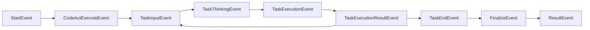
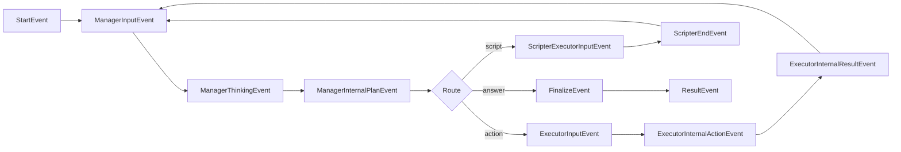

## Overview

DroidRun features a comprehensive event streaming architecture built on [LlamaIndex Workflows](https://docs.llamaindex.ai/en/stable/understanding/workflows/). Events flow through the system in real-time, enabling you to monitor agent execution, build custom UIs, and integrate with external systems.

**Quick Start:**
```python
from droidrun import DroidAgent, ResultEvent
from droidrun.config_manager.config_manager import DroidRunConfig

config = DroidRunConfig()
agent = DroidAgent(goal="Your task", config=config)
handler = agent.run()

# Stream events in real-time
async for event in handler.stream_events():
    print(f"Event: {event.__class__.__name__}")

# Get final result (ResultEvent with success, reason, steps, structured_output)
result: ResultEvent = await handler
print(f"Success: {result.success}, Reason: {result.reason}")
```

### Two-Tier Event System

DroidRun uses a dual-layer event architecture:

1. **Coordination Events** (`droidrun/agent/droid/events.py`) - Lightweight routing events for workflow orchestration between DroidAgent and child agents
2. **Internal Events** (agent-specific `events.py` files) - Rich debugging events with full metadata, streamed to external consumers

```python
# Coordination Event (workflow routing only, NOT streamed)
class ExecutorInputEvent(Event):
    current_subgoal: str  # Minimal data for routing

# Internal Event (streamed to frontend/logs with full context)
class ExecutorInternalActionEvent(Event):
    action_json: str       # Raw JSON of selected action
    thought: str          # LLM's reasoning process
    description: str      # Human-readable description
```

**Key distinction:**
- **Coordination events** trigger workflow steps (e.g., `ManagerInputEvent` → runs Manager)
- **Internal events** are streamed for monitoring (e.g., `ManagerInternalPlanEvent` → shows plan details)
- **ResultEvent** is the final return value from `agent.run()` (includes success, reason, steps, structured_output)
- **StopEvent** is a LlamaIndex internal event (filtered, never streamed to consumers)

## Event Categories

### Coordination Events

Located in `/droidrun/agent/droid/events.py`, these events control workflow flow between DroidAgent and child agents:

| Event | Purpose | Fields |
|-------|---------|--------|
| `ManagerInputEvent` | Trigger Manager planning | None (signal only) |
| `ManagerPlanEvent` | Manager → DroidAgent routing | `plan`, `current_subgoal`, `thought`, `manager_answer` |
| `ExecutorInputEvent` | Trigger Executor action | `current_subgoal` |
| `ExecutorResultEvent` | Executor → DroidAgent routing | `action`, `outcome`, `error`, `summary`, `full_response` |
| `CodeActExecuteEvent` | Trigger CodeAct execution | `task` (Task object) |
| `CodeActResultEvent` | CodeAct → DroidAgent routing | `success`, `reason`, `task` |
| `ScripterExecutorInputEvent` | Trigger Scripter workflow | `task` (str) |
| `ScripterExecutorResultEvent` | Scripter → DroidAgent routing | `task`, `message`, `success`, `code_executions` |
| `FinalizeEvent` | Signal task completion | `success`, `reason` |
| `ResultEvent` | Final workflow result | `success`, `reason`, `steps`, `structured_output` |

### Internal Events (Streamed)

These events are written to the event stream and contain full debugging metadata. They are located in agent-specific event files:

#### Manager Events
```python
# File: droidrun/agent/manager/events.py
class ManagerThinkingEvent(Event):
    """Manager is analyzing state"""
    pass

class ManagerInternalPlanEvent(Event):
    """Manager created a plan (with full metadata)"""
    plan: str
    current_subgoal: str
    thought: str
    manager_answer: str = ""
    memory_update: str = ""  # Debugging: LLM's memory additions
```

#### Executor Events
```python
# File: droidrun/agent/executor/events.py
class ExecutorInternalActionEvent(Event):
    """Executor selected an action (with reasoning)"""
    action_json: str      # Raw JSON string
    thought: str         # LLM's reasoning process
    description: str     # Human-readable description
    full_response: str = ""  # Full LLM response for development

class ExecutorInternalResultEvent(Event):
    """Executor completed action (with full debug info)"""
    action: Dict
    outcome: bool
    error: str
    summary: str
    thought: str = ""
    action_json: str = ""
    full_response: str = ""  # Full LLM response for development
```

#### CodeAct Events
```python
# File: droidrun/agent/codeact/events.py
class TaskInputEvent(Event):
    """Task input received"""
    input: list[ChatMessage]

class TaskThinkingEvent(Event):
    """CodeAct is reasoning"""
    thoughts: Optional[str] = None
    code: Optional[str] = None
    usage: Optional[UsageResult] = None

class TaskExecutionEvent(Event):
    """Executing code"""
    code: str
    globals: dict[str, str] = {}
    locals: dict[str, str] = {}

class TaskExecutionResultEvent(Event):
    """Code execution result"""
    output: str

class TaskEndEvent(Event):
    """Task finished"""
    success: bool
    reason: str

class EpisodicMemoryEvent(Event):
    """Episodic memory snapshot"""
    episodic_memory: EpisodicMemory
```

#### Scripter Events
```python
# File: droidrun/agent/scripter/events.py
class ScripterInputEvent(Event):
    """Scripter input"""
    input: List  # List of ChatMessages

class ScripterThinkingEvent(Event):
    """Scripter thinking"""
    thoughts: str
    code: Optional[str] = None
    full_response: str = ""

class ScripterExecutionEvent(Event):
    """Scripter executing code"""
    code: str

class ScripterExecutionResultEvent(Event):
    """Scripter execution result"""
    output: str

class ScripterEndEvent(Event):
    """Scripter finished"""
    message: str
    success: bool
    code_executions: int = 0
```

#### Common Events
```python
# File: droidrun/agent/common/events.py
class ScreenshotEvent(Event):
    """Screenshot captured"""
    screenshot: bytes

class RecordUIStateEvent(Event):
    """UI state recorded"""
    ui_state: list[Dict[str, Any]]

# Macro events for coordinate-based actions
class TapActionEvent(MacroEvent):
    x: int
    y: int
    element_index: int = None
    element_text: str = ""
    element_bounds: str = ""

class SwipeActionEvent(MacroEvent):
    start_x: int
    start_y: int
    end_x: int
    end_y: int
    duration_ms: int

class DragActionEvent(MacroEvent):
    start_x: int
    start_y: int
    end_x: int
    end_y: int
    duration_ms: int

class InputTextActionEvent(MacroEvent):
    text: str

class KeyPressActionEvent(MacroEvent):
    keycode: int
    key_name: str = ""

class StartAppEvent(MacroEvent):
    package: str
    activity: str = None
```

### Telemetry Events

Located in `/droidrun/telemetry/events.py`, these capture high-level metrics:

```python
class DroidAgentInitEvent(TelemetryEvent):
    """Agent initialization"""
    goal: str
    llms: Dict[str, str]
    tools: str
    max_steps: int
    timeout: int
    vision: Dict[str, bool]
    reasoning: bool
    enable_tracing: bool
    debug: bool
    save_trajectories: str = "none"
    runtype: str = "developer"

class PackageVisitEvent(TelemetryEvent):
    """App/package visited"""
    package_name: str
    activity_name: str
    step_number: int

class DroidAgentFinalizeEvent(TelemetryEvent):
    """Agent finalized"""
    success: bool
    reason: str
    steps: int
    unique_packages_count: int
    unique_activities_count: int
```

## Capturing Events

### Basic Event Streaming

The simplest way to capture events is through the workflow handler's `stream_events()` method:

```python
from droidrun import DroidAgent, ResultEvent
from droidrun.config_manager.config_manager import DroidRunConfig

# Initialize agent with config
config = DroidRunConfig()
agent = DroidAgent(
    goal="Open Settings and enable WiFi",
    config=config
)

# Run and capture events
handler = agent.run()

async for event in handler.stream_events():
    print(f"Event: {event.__class__.__name__}")

    # Access event-specific fields safely
    if hasattr(event, 'thought'):
        print(f"  Thought: {event.thought}")
    if hasattr(event, 'action'):
        print(f"  Action: {event.action}")

# Get final result
result: ResultEvent = await handler
print(f"Success: {result.success}")
print(f"Reason: {result.reason}")
print(f"Steps: {result.steps}")
```

### Building a Custom Event Handler

Create rich monitoring experiences by building custom handlers:

```python
import logging
from typing import List
from rich.console import Console
from rich.live import Live
from rich.panel import Panel
from droidrun import DroidAgent
from droidrun.config_manager.config_manager import DroidRunConfig
from droidrun.agent.manager.events import ManagerThinkingEvent, ManagerInternalPlanEvent
from droidrun.agent.executor.events import ExecutorInternalActionEvent, ExecutorInternalResultEvent
from droidrun.agent.codeact.events import TaskThinkingEvent, TaskExecutionResultEvent
from droidrun.agent.common.events import ScreenshotEvent, RecordUIStateEvent
from droidrun.agent.droid.events import FinalizeEvent

class CustomEventHandler(logging.Handler):
    def __init__(self):
        super().__init__()
        self.console = Console()
        self.events: List[str] = []

    def handle_event(self, event):
        """Process different event types"""

        # Manager events
        if isinstance(event, ManagerThinkingEvent):
            self.console.print("🧠 [blue]Manager analyzing state...[/blue]")

        elif isinstance(event, ManagerInternalPlanEvent):
            self.console.print(f"📋 [green]Plan created:[/green] {event.current_subgoal}")
            if event.memory_update:
                self.console.print(f"   💾 Memory: {event.memory_update[:100]}...")

        # Executor events
        elif isinstance(event, ExecutorInternalActionEvent):
            self.console.print(f"🎯 [yellow]Action:[/yellow] {event.description}")
            self.console.print(f"   💭 Thought: {event.thought[:100]}...")

        elif isinstance(event, ExecutorInternalResultEvent):
            status = "✅" if event.outcome else "❌"
            self.console.print(f"{status} {event.summary}")
            if not event.outcome:
                self.console.print(f"   ⚠️  Error: {event.error}")

        # CodeAct events
        elif isinstance(event, TaskThinkingEvent):
            if event.thoughts:
                self.console.print(f"💭 [cyan]Thinking:[/cyan] {event.thoughts[:150]}...")
            if event.code:
                self.console.print("💻 [magenta]Executing code[/magenta]")

        elif isinstance(event, TaskExecutionResultEvent):
            self.console.print(f"📤 Result: {event.output[:100]}...")

        # Screenshot & UI state
        elif isinstance(event, ScreenshotEvent):
            self.console.print("📸 Screenshot captured")

        elif isinstance(event, RecordUIStateEvent):
            element_count = len(event.ui_state)
            self.console.print(f"📱 UI state: {element_count} elements")

        # Completion
        elif isinstance(event, FinalizeEvent):
            status = "🎉 Success" if event.success else "❌ Failed"
            self.console.print(f"{status}: {event.reason}")

# Use the custom handler
handler_instance = CustomEventHandler()
config = DroidRunConfig()

agent = DroidAgent(goal="Take a screenshot", config=config)
workflow_handler = agent.run()

async for event in workflow_handler.stream_events():
    handler_instance.handle_event(event)

result: ResultEvent = await workflow_handler
print(f"\nFinal result: {result.success} - {result.reason}")
```

### Real-World Example: LogHandler

DroidRun's CLI uses a sophisticated event handler with Rich UI. Here's the simplified version from `/droidrun/cli/logs.py`:

```python
class LogHandler(logging.Handler):
    def __init__(self, goal: str, rich_text: bool = True):
        super().__init__()
        self.goal = goal
        self.current_step = "Initializing..."
        self.is_completed = False
        self.is_success = False

        if rich_text:
            self.console = Console()
            self.logs: List[str] = []

    def handle_event(self, event):
        """Handle streaming events from agent workflow"""

        # Manager events
        if isinstance(event, ManagerThinkingEvent):
            self.current_step = "Manager analyzing state..."

        elif isinstance(event, ManagerInternalPlanEvent):
            self.current_step = "Plan created"
            if event.current_subgoal:
                logger.info(f"📋 Next step: {event.current_subgoal[:150]}")

        # Executor events
        elif isinstance(event, ExecutorInternalActionEvent):
            self.current_step = "Selecting action..."
            logger.info(f"🎯 Action: {event.description}")

        elif isinstance(event, ExecutorInternalResultEvent):
            if event.outcome:
                self.current_step = "Action completed"
                logger.info(f"✅ {event.summary}")
            else:
                self.current_step = "Action failed"
                logger.info(f"❌ {event.summary} ({event.error})")

        # CodeAct events
        elif isinstance(event, TaskThinkingEvent):
            if event.thoughts:
                logger.info(f"🧠 Thinking: {event.thoughts[:150]}")
            if event.code:
                logger.info("💻 Executing action code")

        elif isinstance(event, TaskExecutionResultEvent):
            if "Error" in str(event.output):
                logger.info(f"❌ Action error: {event.output[:100]}")
            else:
                logger.info(f"⚡ Result: {event.output[:100]}")

        # Finalization
        elif isinstance(event, FinalizeEvent):
            self.is_completed = True
            self.is_success = event.success
            if event.success:
                logger.info(f"🎉 Goal achieved: {event.reason}")
            else:
                logger.info(f"❌ Goal failed: {event.reason}")

# Usage in CLI
log_handler = LogHandler(goal=goal, rich_text=True)
logger.addHandler(log_handler)

with log_handler.render():  # Rich Live rendering
    handler = agent.run()
    async for event in handler.stream_events():
        log_handler.handle_event(event)
    result: ResultEvent = await handler
```

## Shared State Access

DroidAgent maintains shared state (`DroidAgentState`) accessible across all agents:

```python
from droidrun.agent.droid.events import DroidAgentState

# The shared state (accessed via agent.shared_state)
state = DroidAgentState(
    # Task context
    instruction="Your goal here",
    step_number=0,

    # Device state
    formatted_device_state="...",     # Complete UI hierarchy text
    a11y_tree=[...],                  # Raw accessibility tree (list of dicts)
    phone_state={...},                # Phone metadata (dict)
    screenshot=bytes,                 # Current screenshot
    width=1080,                       # Screen width
    height=1920,                      # Screen height
    focused_text="...",               # Currently focused element text

    # App Cards
    app_card="...",                   # Current app-specific instructions
    current_package_name="...",       # Current app package
    current_activity_name="...",      # Current activity

    # Action tracking
    action_history=[...],             # All actions taken (list of dicts)
    action_pool=[...],                # Raw action JSONs
    summary_history=[...],            # Action summaries (list of str)
    action_outcomes=[...],            # Success/failure bools (list of bool)
    error_descriptions=[...],         # Error messages (list of str)
    last_action={...},                # Most recent action (dict)
    last_summary="...",               # Most recent summary
    last_action_thought="...",        # Most recent thought

    # Planning
    plan="...",                       # Current plan
    current_subgoal="...",            # Active subgoal
    finish_thought="...",             # Completion reasoning
    progress_status="...",            # Current progress
    manager_answer="...",             # Answer for answer-type tasks
    memory="...",                     # Agent memory
    message_history=[...],            # Chat history

    # Error handling
    error_flag_plan=False,            # Error escalation flag
    err_to_manager_thresh=2,          # Error threshold

    # App tracking
    visited_packages=set(),           # Visited apps
    visited_activities=set(),         # Visited activities

    # Script execution
    scripter_history=[...],           # Script results (list of dicts)
    last_scripter_message="...",      # Most recent scripter response
    last_scripter_success=True,       # Most recent scripter status

    # Device state comparison
    previous_formatted_device_state="...",  # For before/after comparison

    # Output and metadata
    output_dir="",                    # Output directory path
    user_id=None,                     # Optional user ID

    # Custom data
    custom_variables={...},           # User-defined variables
)

# Access in events
async for event in handler.stream_events():
    if isinstance(event, ManagerInternalPlanEvent):
        # State is shared across all agents
        current_plan = agent.shared_state.plan
        current_step = agent.shared_state.step_number
        visited_apps = agent.shared_state.visited_packages
```

## Event Flow by Mode

### Direct Execution Mode (`reasoning=False`)



**Events emitted:**
1. `StartEvent` → DroidAgent starts (streamed)
2. `CodeActExecuteEvent` → CodeAct agent triggered
3. `TaskInputEvent` → Task input prepared
4. `TaskThinkingEvent` → LLM thinking (thoughts + code)
5. `TaskExecutionEvent` → Code executing
6. `TaskExecutionResultEvent` → Execution result
7. Loop back to step 3 or proceed to 8
8. `TaskEndEvent` → Task complete
9. `FinalizeEvent` → DroidAgent finalizing (streamed)
10. Optional: If `output_model` is provided, StructuredOutputAgent runs to extract structured data
11. `ResultEvent` → Final result returned (success, reason, steps, structured_output)

### Reasoning Mode (`reasoning=True`)



**Events emitted (per cycle):**

**Manager Phase:**
1. `ManagerInputEvent` → Manager triggered
2. `ManagerThinkingEvent` → Manager analyzing
3. `ManagerInternalPlanEvent` → Plan created (with thought, subgoal)

**Executor Phase (if action needed):**
4. `ExecutorInputEvent` → Executor triggered
5. `ExecutorInternalActionEvent` → Action selected (with thought)
6. `ExecutorInternalResultEvent` → Action result
7. Loop back to Manager (step 1)

**Scripter Phase (if `<script>` tag):**
4. `ScripterExecutorInputEvent` → Scripter triggered
5. `ScripterInputEvent` → Scripter input prepared
6. `ScripterThinkingEvent` → Scripter thinking
7. `ScripterExecutionEvent` → Code executing
8. `ScripterExecutionResultEvent` → Execution result
9. `ScripterEndEvent` → Scripter complete
10. Loop back to Manager (step 1)

**Completion:**
- `FinalizeEvent` → Task complete (when Manager provides answer, streamed)
- Optional: If `output_model` is provided, StructuredOutputAgent runs to extract structured data from the final answer
- `ResultEvent` → Final result returned (success, reason, steps, structured_output)

## Nested Event Handling

DroidAgent streams nested workflow events to its parent context. This is implemented in the `handle_stream_event()` method:

```python
# In DroidAgent.handle_stream_event()
def handle_stream_event(self, ev: Event, ctx: Context):
    """Route nested events to parent stream or handle internally"""

    # Internal handling (don't stream upstream)
    if isinstance(ev, EpisodicMemoryEvent):
        self.current_episodic_memory = ev.episodic_memory
        return

    # Skip StopEvent (workflow-internal coordination only)
    if not isinstance(ev, StopEvent):
        ctx.write_event_to_stream(ev)  # Stream to parent

        # Trajectory tracking for different event types
        if isinstance(ev, ScreenshotEvent):
            self.trajectory.screenshots.append(ev.screenshot)
        elif isinstance(ev, MacroEvent):
            self.trajectory.macro.append(ev)
        elif isinstance(ev, RecordUIStateEvent):
            self.trajectory.ui_states.append(ev.ui_state)
        else:
            self.trajectory.events.append(ev)
```

**Key behaviors:**
- All child workflow events (Manager, Executor, CodeAct, Scripter) are automatically streamed to the parent
- `EpisodicMemoryEvent` is captured internally but not streamed (used for memory state tracking)
- `StopEvent` is filtered out (workflow-internal coordination only, not for external consumers)
- Events are captured for trajectory recording when `save_trajectory` is enabled

## Best Practices

### 1. Event Type Checking

Always use `isinstance()` for type-safe event handling:

```python
if isinstance(event, ManagerInternalPlanEvent):
    # TypeScript-safe: event.plan is guaranteed to exist
    print(event.plan)
```

### 2. Graceful Field Access

Use `hasattr()` for optional fields:

```python
if hasattr(event, 'memory_update') and event.memory_update:
    print(f"Memory: {event.memory_update}")
```

### 3. Event Filtering

Filter events by category for focused monitoring:

```python
# Only planning events
async for event in handler.stream_events():
    if isinstance(event, (ManagerThinkingEvent, ManagerInternalPlanEvent)):
        # Handle planning events
        pass

# Only action events
async for event in handler.stream_events():
    if isinstance(event, (ExecutorInternalActionEvent, ExecutorInternalResultEvent)):
        # Handle action events
        pass
```

### 4. Performance Considerations

For high-frequency events, use buffering:

```python
import asyncio
from collections import deque

event_buffer = deque(maxlen=100)

async def buffer_events():
    async for event in handler.stream_events():
        event_buffer.append(event)

        # Process in batches
        if len(event_buffer) >= 10:
            await process_batch(list(event_buffer))
            event_buffer.clear()
```

### 5. Error Handling

Always wrap event handling in try-except:

```python
async for event in handler.stream_events():
    try:
        handler_instance.handle_event(event)
    except Exception as e:
        logger.error(f"Event handling failed: {e}", exc_info=True)
        # Continue processing other events
        continue
```

## Advanced Patterns

### Event Aggregation

Collect events for post-execution analysis:

```python
from collections import defaultdict

class EventAggregator:
    def __init__(self):
        self.events_by_type = defaultdict(list)
        self.timeline = []

    def capture(self, event):
        event_type = event.__class__.__name__
        self.events_by_type[event_type].append(event)
        self.timeline.append((time.time(), event))

    def get_stats(self):
        return {
            "total_events": len(self.timeline),
            "by_type": {k: len(v) for k, v in self.events_by_type.items()},
            "duration": self.timeline[-1][0] - self.timeline[0][0] if self.timeline else 0,
        }

# Usage
aggregator = EventAggregator()

async for event in handler.stream_events():
    aggregator.capture(event)

stats = aggregator.get_stats()
print(f"Processed {stats['total_events']} events in {stats['duration']:.2f}s")
```

### Real-Time Webhooks

Stream events to external systems:

```python
import httpx
import time

class WebhookStreamer:
    def __init__(self, webhook_url: str):
        self.webhook_url = webhook_url
        self.client = httpx.AsyncClient()

    async def send_event(self, event):
        payload = {
            "type": event.__class__.__name__,
            "timestamp": time.time(),
            "data": event.model_dump() if hasattr(event, 'model_dump') else str(event),
        }

        try:
            await self.client.post(self.webhook_url, json=payload)
        except Exception as e:
            print(f"Webhook failed: {e}")

    async def close(self):
        await self.client.aclose()

# Usage
from droidrun.agent.manager.events import ManagerInternalPlanEvent
from droidrun.agent.executor.events import ExecutorInternalResultEvent
from droidrun.agent.droid.events import FinalizeEvent

streamer = WebhookStreamer("https://api.example.com/events")

try:
    async for event in handler.stream_events():
        # Filter important events
        if isinstance(event, (ManagerInternalPlanEvent, ExecutorInternalResultEvent, FinalizeEvent)):
            await streamer.send_event(event)
finally:
    await streamer.close()
```

### Event Replay

Record and replay events for debugging:

```python
import pickle

class EventRecorder:
    def __init__(self, filepath: str):
        self.filepath = filepath
        self.events = []

    def record(self, event):
        self.events.append(event)

    def save(self):
        with open(self.filepath, 'wb') as f:
            pickle.dump(self.events, f)

    @staticmethod
    def load(filepath: str):
        with open(filepath, 'rb') as f:
            return pickle.load(f)

    def replay(self, handler_func):
        """Replay recorded events through a handler"""
        for event in self.events:
            handler_func(event)

# Record
recorder = EventRecorder("session.pkl")
async for event in handler.stream_events():
    recorder.record(event)
recorder.save()

# Replay
events = EventRecorder.load("session.pkl")
for event in events:
    print(f"Replaying: {event.__class__.__name__}")
```

## Integration Examples

### FastAPI WebSocket Streaming

```python
from fastapi import FastAPI, WebSocket
from droidrun import DroidAgent
from droidrun.config_manager.config_manager import DroidRunConfig
import json

app = FastAPI()

@app.websocket("/agent/stream")
async def agent_stream(websocket: WebSocket):
    await websocket.accept()

    # Get goal from client
    goal = await websocket.receive_text()

    # Create agent with config
    config = DroidRunConfig()
    agent = DroidAgent(goal=goal, config=config)
    handler = agent.run()

    # Stream events to WebSocket
    try:
        async for event in handler.stream_events():
            event_data = {
                "type": event.__class__.__name__,
                "data": event.model_dump() if hasattr(event, 'model_dump') else {},
            }
            await websocket.send_text(json.dumps(event_data))

        # Send final result
        result: ResultEvent = await handler
        await websocket.send_text(json.dumps({
            "type": "result",
            "data": {
                "success": result.success,
                "reason": result.reason,
                "steps": result.steps,
            }
        }))

    except Exception as e:
        await websocket.send_text(json.dumps({"type": "error", "message": str(e)}))
    finally:
        await websocket.close()
```

### Discord Bot Integration

```python
import discord
import time
from discord.ext import commands
from droidrun import DroidAgent
from droidrun.config_manager.config_manager import DroidRunConfig
from droidrun.agent.manager.events import ManagerInternalPlanEvent
from droidrun.agent.executor.events import ExecutorInternalActionEvent

bot = commands.Bot(command_prefix="!")

@bot.command()
async def automate(ctx, *, goal: str):
    """Run DroidRun automation and stream status to Discord"""

    status_msg = await ctx.send(f"🤖 Starting automation: {goal}")

    config = DroidRunConfig()
    agent = DroidAgent(goal=goal, config=config)
    handler = agent.run()

    last_update = time.time()

    async for event in handler.stream_events():
        # Update every 2 seconds to avoid rate limits
        if time.time() - last_update > 2:
            if isinstance(event, ManagerInternalPlanEvent):
                await status_msg.edit(content=f"📋 Planning: {event.current_subgoal[:100]}")
            elif isinstance(event, ExecutorInternalActionEvent):
                await status_msg.edit(content=f"⚡ Action: {event.description[:100]}")
            last_update = time.time()

    result: ResultEvent = await handler

    if result.success:
        await status_msg.edit(content=f"✅ Success: {result.reason[:1000]}")
    else:
        await status_msg.edit(content=f"❌ Failed: {result.reason[:1000]}")
```

## Troubleshooting

### Events Not Streaming

**Problem:** No events appearing in stream

**Solution:**
```python
# Ensure you're awaiting the async iterator
async for event in handler.stream_events():  # ✅ Correct
    print(event)

# Not:
for event in handler.stream_events():  # ❌ Wrong
    print(event)
```

### Missing Event Fields

**Problem:** `AttributeError: 'Event' object has no attribute 'X'`

**Solution:**
```python
# Always check field existence
if hasattr(event, 'thought') and event.thought:
    print(event.thought)

# Or use getattr with default
thought = getattr(event, 'thought', 'No thought provided')
```

### Nested Events Not Appearing

**Problem:** Child workflow events not visible

**Solution:**
```python
# DroidAgent automatically streams nested events
# Just ensure you're iterating the top-level handler
agent = DroidAgent(...)
handler = agent.run()  # Top-level workflow

# This captures ALL events (DroidAgent + children)
async for event in handler.stream_events():
    print(event)  # Will include Manager, Executor, CodeAct events
```

## See Also

- [Agent Architecture](/docs/v4/concepts/agent) - Understanding the multi-agent system
- [LlamaIndex Workflows](https://docs.llamaindex.ai/en/stable/understanding/workflows/) - Underlying workflow framework
- [Configuration](/docs/v4/guides/configuration) - Configuring agent behavior
